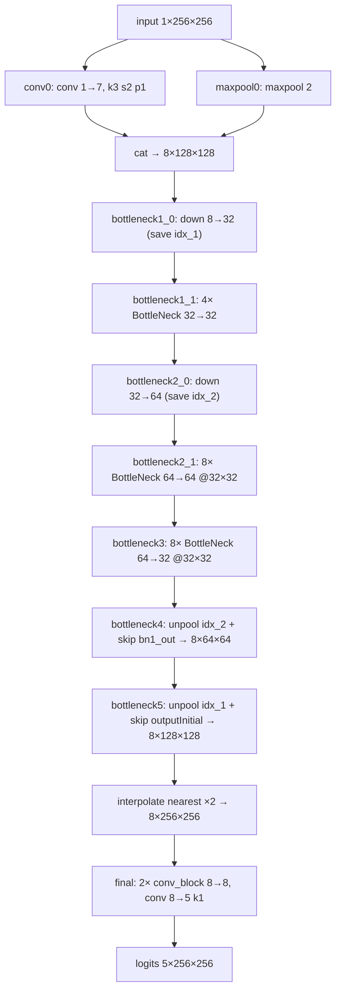

# Model architectures

What the networks in this repository actually are: the three definitions
(`ENet.py`, `UNet.py`, `ShallowNet.py`), how the shared config keys select and
shape them, and how they are called from the train/infer path. Every number here
is reproducible with the command in the last section.

## Which model the recorded runs train

Every recorded run except `E010_unet2d` trains an `ENet`; all but two of them
train the same `ENet(in_dim=in_slices, out_dim=K=5, kernels=8, factor=2)` —
**284,003 parameters**. The class is looked up by name in the registry
(`configType.py:43-47` `NETWORKS = {'shallowCNN': shallowCNN, 'ENet': ENet, 'UNet':
UNet}`) and instantiated at `main.py:109` as
`net_class(config.in_slices, K, kernels=config.kernels, factor=config.factor)`.
The architecture is therefore fixed by `net_name` / `kernels` / `factor` /
`in_slices` in `configs/<id>.yaml`, not in code.

|Run line|Config(s)|`net_name`|`kernels`|`factor`|`in_slices`|Params|
|---|---|---|---|---|---|---|
|E000, E001, E014_hu_soft, E014_hu_wide, E015_augment, E016_aug_noelastic, E017_aorta_huwide, E018_aorta_augment, E019_aorta_ce_dice, E020_aorta_augment_50ep|`configs/<id>.yaml`|`ENet`|8|2|1|284,003|
|E008 (2.5D)|`configs/E008_25d.yaml`|`ENet`|8|2|3|284,073|
|E010_large_enet|`configs/E010_large_enet.yaml`|`ENet`|16|4|1|392,891|
|E010_unet2d|`configs/E010_unet2d.yaml`|`UNet`|32|4|1|7,762,135|
|debug / toy runs ("dummy network", `readme.md:43`)|none — no registry row|`shallowCNN`|ignored|ignored|1|3,245|

`configs/E000_baseline.yaml` and `configs/E000_baseline_spatial_resampling.yaml`
are reference copies of settings that predate the YAML workflow; they use the
same `ENet` 8/2.

Evidence for the 284,003: the recorded runs report it directly —
`results/E014_hu_soft/stats.json`, `results/E014_hu_wide/`, `E015_augment/`,
`E017_aorta_huwide/`, `E018_aorta_augment/`, `E019_aorta_ce_dice/` and
`E020_aorta_augment_50ep/` all carry `"n_params": 284003`. The other four counts
come from instantiating the classes (last section).

## ENet

`ENet.py`. An ERFNet-style encoder/decoder: residual, factorized convolutions,
no transposed convolutions — pooling is undone with the indices the
downsampling stages saved.

### Topology

Measured with forward hooks on `ENet(1, 5, kernels=8, factor=2)` and a
`1x1x256x256` input. Output of the network is **logits**, `5x256x256`.

|Stage|Operation|Output|
|---|---|---|
|`conv0` + `maxpool0`|Conv 1→7, k3 s2 p1 (`ENet.py:191`) ‖ MaxPool 2 (`ENet.py:192`), concatenated channel-wise (`ENet.py:238`)|8×128×128|
|`bottleneck1_0`|`BottleNeckDownSampling` 8→32 (`ENet.py:195`), stores maxpool indices|32×64×64|
|`bottleneck1_1`|4× `BottleNeck` 32→32 (`ENet.py:196-199`)|32×64×64|
|`bottleneck2_0`|`BottleNeckDownSampling` 32→64 (`ENet.py:200`), stores indices|64×32×32|
|`bottleneck2_1`|8× `BottleNeck` 64→64, dropout 0.1, dilation 2/4/8/16, asym 5×1+1×5 (`ENet.py:201-208`)|64×32×32|
|`bottleneck3`|8× `BottleNeck`, last one 64→32 with `dilate_last` (`ENet.py:211-218`)|32×32×32|
|`bottleneck4`|`BottleNeckUpSampling` 64→32 (`MaxUnpool2d` with `indices_2` + skip `bn1_out`) then `BottleNeck` 32→8 (`ENet.py:221-223`)|8×64×64|
|`bottleneck5`|`BottleNeckUpSampling` 16→8 (`MaxUnpool2d` with `indices_1` + skip `outputInitial`) then `BottleNeck` 8→8 (`ENet.py:224-225`)|8×128×128|
|`final`|nearest `interpolate(scale_factor=2)` (`ENet.py:254`), two `conv_block` 8→8 k3, Conv 8→5 k1 (`ENet.py:228-230`)|5×256×256|



### Blocks

All line references are `ENet.py`.

- `conv_block` (`:39`) = `Conv2d` → `BatchNorm2d` → `PReLU`; the atom used
  everywhere. `conv_block_asym` (`:45`) = a 5×1 conv followed by a 1×5 conv
  (`padding=(2, 0)` / `(0, 2)`) before BatchNorm and PReLU — a 5×5 kernel at the
  parameter cost of 5+5.
- `BottleNeck` (`:56`) = residual block. Secondary branch: 1×1 → (3×3 dilated,
  or 5×1+1×5 `conv_block_asym` when `asym=True`) → 1×1, then `Dropout`; the
  result is added to the main branch and passed through `PReLU`
  (`forward`, `:87`). `projectionFactor` (the config's `factor`) sets
  `mid_dim = in_dim // projectionFactor`, so the middle is narrower than
  in/out. The main branch is `nn.Identity()` — a 1×1 `conv_block` when
  `in_dim > out_dim`, or a 3×3 `conv_block` when `dilate_last`.
- `BottleNeckDownSampling` (`:100`) = an index-returning maxpool branch fused
  with a stride-2 conv branch by adding the pooled tensor into the first `c`
  channels of the conv output (`output[:, :c] += maxpool_output`, `:131`), then
  `PReLU`; it returns `(output, indices)` (`:135`).
- `BottleNeckUpSampling` (`:138`) = `MaxUnpool2d(2)` on the stored indices,
  concatenate the matching skip, then a 1×1/3×3/1×1 residual branch added to the
  unpooled tensor (`:157-171`). It takes the tuple `(in_, indices, skip)` because
  `nn.Sequential` cannot pass several arguments (`:159`).

### Forward order

`ENet.forward` (`:234-255`), verbatim ordering of the calls: `conv0`/`maxpool0`
concatenated, then `bottleneck1_0`, `bottleneck1_1`, `bottleneck2_0`,
`bottleneck2_1`, `bottleneck3`, then `bottleneck4` with `indices_2` and
`bn1_out`, `bottleneck5` with `indices_1` and `outputInitial`, then the ×2
nearest interpolation and `final`. The network returns **logits**; softmax and
argmax happen in the caller (see "How the network is called").

### Parameter distribution

`sum(p.numel() for p in child.parameters())` for `kernels=8, factor=2` — this is
where the budget sits:

|Module|Params|
|---|---|
|`conv0`|70|
|`maxpool0`|0|
|`bottleneck1_0`|524|
|`bottleneck1_1`|14,096|
|`bottleneck2_0`|5,668|
|`bottleneck2_1`|111,712|
|`bottleneck3`|112,737|
|`bottleneck4`|35,837|
|`bottleneck5`|2,128|
|`final`|1,231|
|**total**|**284,003**|

`bottleneck3` 112,737 + `bottleneck2_1` 111,712 = 224,449, i.e. 79 % of the
network, both at 64 channels and 32×32. The high-resolution `final` head carries
1,231 parameters (0.4 %).

### Initialization

`random_weights_init` (`:31`), applied through `ENet.init_weights()` (`:257`)
via `self.apply`: `xavier_normal_` on `Conv2d`/`ConvTranspose2d` weights,
BatchNorm weight `N(1.0, 0.02)`, BatchNorm bias 0.

## What kernels, factor and in_slices mean

`kernels` and `factor` are shared config keys, but `ENet` and `UNet` read them
with different meanings — this is the trap:

|Key|`ENet`|`UNet`|
|---|---|---|
|`kernels`|`K`, the base kernel count; asserts `K > in_dim` (`ENet.py:180`)|base channel width (32 in `E010_unet2d`)|
|`factor`|`projectionFactor`, the bottleneck narrowing divisor (`ENet.py:178`)|number of encoder/decoder levels (4 in `E010_unet2d`)|
|`in_slices`|input channels: 1 = plain 2D, 3 = 2.5D `[z-1, z, z+1]`|same|

Two consequences worth stating explicitly:

1. `ENet`'s `assert K > in_dim` (`:180`) is what forces `conv0` to emit
   `K - in_dim` channels (`:191`), so `torch.cat((conv_0, maxpool_0), dim=1)`
   (`:238`) is exactly `K` channels: 7+1 = 8 at `in_slices=1`, 5+3 = 8 at
   `in_slices=3`. That is the whole difference between E001 and the E008 2.5D
   run: **+70 parameters** (284,073 vs 284,003, single `conv0` weight tensor) and
   no other architectural change.
2. `factor=2` on `ENet` is **not** "two levels"; it is the bottleneck divisor
   (`mid_dim = in_dim // 2`). The spatial reduction is fixed by the two
   `BottleNeckDownSampling` stages (`bottleneck1_0`, `bottleneck2_0`), not by
   `factor`.

`in_slices` is constrained to `{1, 3}` by `TrainConfig.__post_init__`
(`configType.py:39-41`), and the 2.5D pairing `[z-1, z, z+1]` is implemented by
the dataset, not by the network.

## UNet

`UNet.py`. The second trained architecture, `E010_unet2d`, 7,762,135 params.

- `ConvBlock` (`:26`) = two (Conv 3×3-BN-PReLU) stacks (`:29-37`), the encoder
  and decoder atom.
- `UNet.__init__` (`:43`) reads `base_channels = kernels` (default 32, `:47`) and
  `levels = factor` (default 4, `:48`), then builds
  `channels = [base * 2**level for level in range(levels)]` (`:52`) = 32/64/128/256,
  an encoder of `ConvBlock`s with `MaxPool2d(2)` between them (`:53-58`), a
  bottleneck `ConvBlock(channels[-1], channels[-1] * 2)` = 256→512 (`:60-61`),
  and a decoder of `ConvTranspose2d(kernel_size=2, stride=2)` +
  `ConvBlock(skip_channels * 2, skip_channels)` (`:63-70`) concatenating
  `reversed(skips)`, plus `final = Conv2d(32, out_dim, 1)` (`:72`).
- `UNet.forward` (`:78`) asserts the input is divisible by `2**levels`
  (`:81`; 256/16 = 16 at `factor=4`) and asserts each upsampled tensor matches
  its skip's spatial shape (`:93`) before the concat.
- Result context: `E010_unet2d` reached 3D Dice foreground mean **0.686** vs
  ENet 8/2's 0.618 on the folded data (chiefly trachea), but the aorta line
  (E017–E020) all runs `ENet` — see `EXPERIMENTS.md`.

## shallowCNN

`ShallowNet.py`. The toy/debug network, 3,245 params. `shallowCNN` (`:36`) =
three `convBatch` layers (`:28`: Conv 3×3-BN-PReLU, `bias=False`) at width
`nG * 4 = 16` (`:39-41`), no downsampling and no skip connections
(`forward`, `:43`). It takes `nG=4` by default and swallows `**kwargs`
(`:37`), so it silently ignores `kernels` and `factor`. This is the "dummy
network" of the course README (`readme.md:43`); it appears in no registry row and
in none of the `configs/`.

## How the network is called

The shared path that gives the architectures meaning:

- **Instantiation.** `main.py:108-111`: `net_class = NETWORKS[config.net_name]`,
  `net = net_class(config.in_slices, K, kernels=config.kernels,
  factor=config.factor)`, then `net.init_weights()`, `net.to(device)`. Device is
  `cuda > mps > cpu` by availability (`main.py:102-104`); the E014+ runs ran
  locally on MPS while E001's reference ran on Snellius (`EXPERIMENTS.md`).
  Inference rebuilds the same network from the run's dumped config through
  `build_net` (`infer.py:59-65`, `NETWORKS[config.net_name](config.in_slices,
  config.K, kernels=..., factor=...)`) and loads `bestweights.pt`.
- **Input tensor.** One grayscale slice per sample (`in_slices=1`), converted to
  `L`, scaled to `[0, 1]` by `img_transform` (`main.py:82-88`), 256×256, batch
  `B=8`.
- **Output.** Raw logits `B×K×256×256`. The caller applies
  `F.softmax(pred_logits / config.temperature, dim=1)` (`main.py:263`) with
  `temperature: 1.0`, and `probs2one_hot` for the metrics (`main.py:266`).
  Inference does the same softmax (`infer.py:80`) and writes
  `probs2class(pred_probs) * 63`.
- **Loss.** The probabilities (not logits) feed the loss: `CrossEntropy`
  (`losses.py:31`) asserts they are a simplex and computes the masked negative
  log-likelihood over `idk`; `CEDiceLoss` (`losses.py:78`) is
  `CrossEntropy + (1 - mean(dice))` where the per-channel soft Dice is
  `(2 * sum(p*g) + eps) / (sum(p) + sum(g) + eps)` with `eps = 1e-5`
  (`losses.py:92-100`), meaned over the classes in `idk`. E019 is the run that
  uses `ce_dice`; E001–E018 use plain `ce`.
- **Training.** Adam, lr 5e-4, betas (0.9, 0.999), 25 epochs (the E016/E020
  configs set 50), batch 8, seed 123, `patience: -1` (no LR schedule),
  `mode: full` (all classes trained, no partial-label masking), 15 train / 5 val
  patients of the SegTHOR 15/5 split.
- **Target.** One-hot from `gt_transform` (`main.py:89-99`); slice labels are
  divided by `63` for `K=5` (`img / (255 / (K - 1))` otherwise), i.e. class
  values 0/63/126/189/252 for the five SegTHOR classes, then `class2one_hot`.

## Architecture-level quirks worth knowing

Four facts with consequences, no proposals:

1. **The middle is one resolution, not three.** Stages 3–5 of the original ENet
   are folded into a single level: `bottleneck2_1` (`:201`) and `bottleneck3`
   (`:211`) are the same 8-block dilated pyramid (dilations 1/2/4/8/16,
   alternating dropout and `asym`), i.e. 16 residual blocks at 32×32 instead of
   three downsampled levels. Only two spatial downsamplings exist
   (`bottleneck1_0`, `bottleneck2_0`), and the decoder's last ×2 is a nearest
   `interpolate` (`:254`), not a learned upsample.
2. **Decoder widths are asymmetric**: 64 → 32 (`bottleneck4`) → 8
   (`bottleneck5`), then two 3×3 convs at width 8 before the 1×1 classifier
   (`:228-230`) — the full-resolution head is narrow.
3. **No post-processing inside the model.** No softmax, no CRF, no
   connected-component filter; all z-continuity and stray-component handling is
   expected downstream (`stitch.py`; largest connected component per class is
   still a plan item in `full_plan.md` §1.7).
4. **The default `in_slices=1` means the forward pass has no z-context.** The
   only 2.5D run (E008) scored *below* E001 (foreground mean 3D Dice 0.486 vs
   0.598, `EXPERIMENTS.md`), at the cost of the +70 `conv0` parameters above.

## Reproducing these numbers

From the repository root — prints the parameters and output shape of every
architecture in the table above:

```bash
cd "/Users/francesco/Desktop/UVA MSC/AI4MI/AI4M"
./ai4mi/bin/python - <<'PY'
import torch
from ENet import ENet
from UNet import UNet
from ShallowNet import shallowCNN

cases = [
    ("ENet 8/2  in=1 (E001-E020)", ENet(1, 5, kernels=8, factor=2), (1, 1, 256, 256)),
    ("ENet 16/4 in=1 (E010_large_enet)", ENet(1, 5, kernels=16, factor=4), (1, 1, 256, 256)),
    ("ENet 8/2  in=3 (E008 2.5D)", ENet(3, 5, kernels=8, factor=2), (1, 3, 256, 256)),
    ("UNet 32x4 in=1 (E010_unet2d)", UNet(1, 5, kernels=32, factor=4), (1, 1, 256, 256)),
    ("shallowCNN in=1", shallowCNN(1, 5), (1, 1, 256, 256)),
]
for name, net, shape in cases:
    net.eval()
    with torch.no_grad():
        out = net(torch.zeros(*shape))
    print(f"{name:36s} params={sum(p.numel() for p in net.parameters()):8d} out={tuple(out.shape)}")
PY
```

Expected rows: `284003`, `392891`, `284073`, `7762135`, `3245`, all with
`out=(1, 5, 256, 256)`. Independent check against a recorded run:

```bash
jq '.n_params' results/E019_aorta_ce_dice/stats.json   # 284003
```