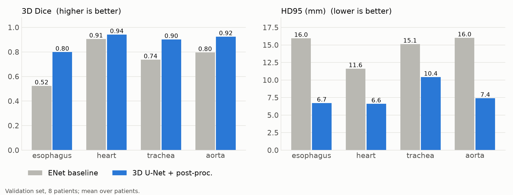
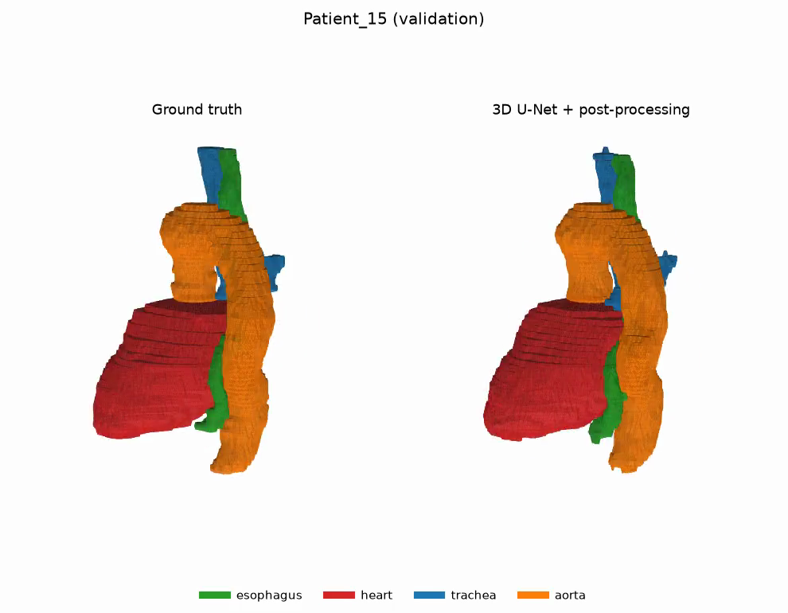
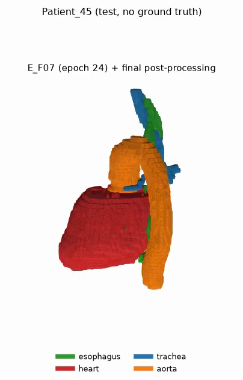

# 3. Results

> **Interim:** epoch-24 checkpoint of E_F07 (`results/snapshots/E_F07_ep24/`).
> Regenerate with `scripts/presentation_tables.py` once the final checkpoint
> exists; the slides must show the submission's numbers.

All numbers: 3D metrics on the 8 validation patients (Patient 09, 10, 12, 15, 17,
19, 37, 38), computed by `metrics3d.py` on the original CT grid with spacing taken
from the CT. HD95 / ASSD in mm; NSD at 2 mm tolerance. Means are over patients.
The baseline E_F00 is the course ENet, trained by the team on the same split.

## Baseline vs 3D U-Net vs 3D U-Net + post-processing

| Metric | Model | esophagus | heart | trachea | aorta | mean |
|---|---|---|---|---|---|---|
| Dice ↑ | ENet baseline (E_F00) | 0.524 | 0.906 | 0.737 | 0.796 | 0.741 |
| Dice ↑ | 3D U-Net (E_F07) | 0.799 | 0.936 | 0.899 | 0.925 | 0.890 |
| Dice ↑ | 3D U-Net + post-proc. | **0.799** | **0.942** | **0.902** | **0.925** | **0.892** |
| IoU ↑ | ENet baseline (E_F00) | 0.364 | 0.828 | 0.606 | 0.670 | 0.617 |
| IoU ↑ | 3D U-Net (E_F07) | 0.668 | 0.881 | 0.817 | 0.860 | 0.807 |
| IoU ↑ | 3D U-Net + post-proc. | **0.668** | **0.890** | **0.822** | **0.860** | **0.810** |
| HD95 (mm) ↓ | ENet baseline (E_F00) | 16.0 | 11.6 | 15.1 | 16.0 | 14.7 |
| HD95 (mm) ↓ | 3D U-Net (E_F07) | 6.7 | 26.0 | 20.0 | 7.7 | 15.1 |
| HD95 (mm) ↓ | 3D U-Net + post-proc. | **6.7** | **6.6** | **10.4** | **7.4** | **7.8** |
| ASSD (mm) ↓ | ENet baseline (E_F00) | 4.07 | 3.56 | 3.05 | 2.98 | 3.41 |
| ASSD (mm) ↓ | 3D U-Net (E_F07) | 1.57 | 3.90 | 1.79 | 1.17 | 2.11 |
| ASSD (mm) ↓ | 3D U-Net + post-proc. | **1.57** | **2.04** | **1.19** | **1.14** | **1.49** |
| NSD (2 mm) ↑ | ENet baseline (E_F00) | 0.490 | 0.474 | 0.692 | 0.622 | 0.570 |
| NSD (2 mm) ↑ | 3D U-Net (E_F07) | 0.810 | 0.590 | 0.873 | 0.866 | 0.785 |
| NSD (2 mm) ↑ | 3D U-Net + post-proc. | **0.810** | **0.598** | **0.881** | **0.867** | **0.789** |

**Reading it.**

- The final model beats the baseline on **all four organs and all five
  metrics**. That is the rubric's "better on all classes". It is not carried by
  one patient: on Dice, every one of the 8 patients is above the baseline's mean
  on every organ. It shows the whole pipeline is better, not that 3D alone is
  the reason. See [05_critical_analysis.md](05_critical_analysis.md).
- The biggest gain is where 2D struggled: esophagus Dice 0.52 -> 0.80, trachea
  0.74 -> 0.90.
- Without post-processing, heart and trachea HD95 are *worse* than the baseline.
  That is not a systematic problem. It comes from single stray predictions:
  Patient_37's heart (HD95 160 mm) and Patient_17's trachea (103 mm). Post-processing
  removes them ([04_postprocessing.md](04_postprocessing.md)).
- Heart NSD stays low (0.60 here, 0.47 for the baseline) even at 0.94 Dice. A 2 mm
  tolerance is strict for an organ this large, so many surface points of a good
  overlap still fall outside it. The cause is not investigated further (worth a
  per-region look if time allows).

## Per patient (3D U-Net + post-processing, Dice / HD95 mm)

| Patient | esophagus | heart | trachea | aorta |
|---|---|---|---|---|
| Patient_09 | 0.807 / 5.0 | 0.942 / 10.0 | 0.910 / 10.0 | 0.912 / 7.7 |
| Patient_10 | 0.863 / 6.0 | 0.915 / 10.5 | 0.904 / 8.0 | 0.927 / 12.2 |
| Patient_12 | 0.823 / 4.9 | 0.933 / 6.3 | 0.922 / 25.0 | 0.926 / 6.0 |
| Patient_15 | 0.761 / 5.6 | 0.955 / 5.0 | 0.897 / 5.1 | 0.912 / 5.4 |
| Patient_17 | 0.815 / 8.1 | 0.954 / 5.0 | 0.881 / 10.8 | 0.911 / 17.5 |
| Patient_19 | 0.694 / 13.3 | 0.942 / 7.5 | 0.866 / 12.9 | 0.925 / 5.0 |
| Patient_37 | 0.866 / 2.7 | 0.933 / 5.5 | 0.919 / 3.5 | 0.943 / 3.1 |
| Patient_38 | 0.760 / 8.2 | 0.958 / 3.2 | 0.918 / 8.1 | 0.941 / 2.5 |

Hardest cases: Patient_19's esophagus (a gap, see the post-processing doc),
Patient_12's trachea (LCC removes a real piece beyond a gap), Patient_17's
aorta.

## Qualitative

| Figure | Shows |
|---|---|
|  | Patient_37 before post-processing: heart predicted far below the real heart, the cause of the 160 mm HD95 |
|  | Patient_37 after post-processing: matches the GT |
|  | Patient_15 (hardest patient overall): close match, aorta slightly fragmented at the bottom |
|  | A test scan (no GT): complete, clean prediction |

Rotating videos (gif/mp4) for 3 val patients and all 20 test scans are in
`results/snapshots/E_F07_ep24/{val,test}/figures*/`. A gallery of the 20 test
videos was shared separately as an artifact.

## Context

- **Literature on the SegTHOR test set:** nnU-Net 0.80 / 0.93 / 0.87 / 0.94; a
  2D dilated residual U-Net 0.86 / 0.94 / 0.93 / 0.94 (esophagus / heart /
  trachea / aorta). Our numbers are on validation, not test, so they are not
  directly comparable, but they are in the same range.
- **Comparison to the 2D and 2.5D U-Nets:** E_F05 and E_F06 are still training,
  on identical data and recipe. Their numbers go here once done. That comparison
  isolates 3D vs 2.5D vs 2D.
- **Earlier 2D U-Net, different preprocessing** (E_F04, HU window, no
  resampling): 0.734 / 0.925 / 0.873 / 0.883.

## Cost

| | 2D U-Net E_F04 | 3D U-Net E_F07 |
|---|---|---|
| GPU | H100 | A100 (slower) |
| Training | 138 epochs, 7.4 h | 300 epochs, ~6.9 h (estimate; final in `stats.json`) |
| Inference | — | ~2.5 s per patient |
