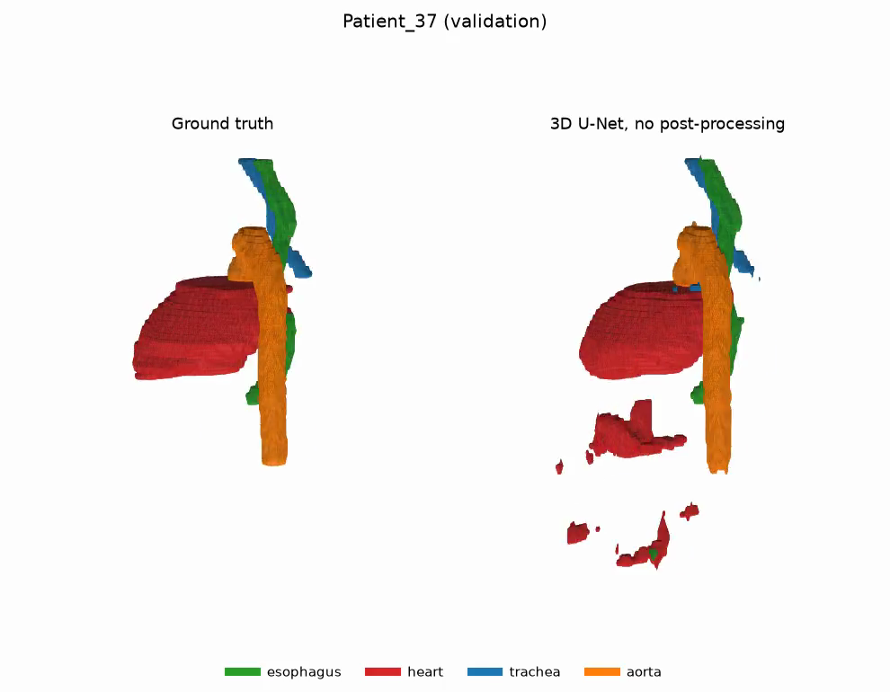
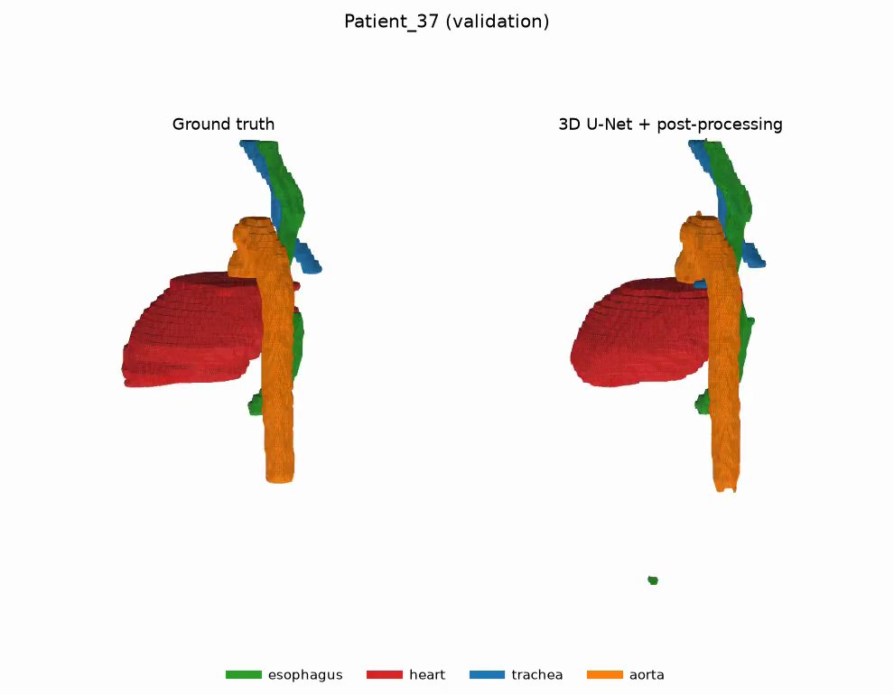
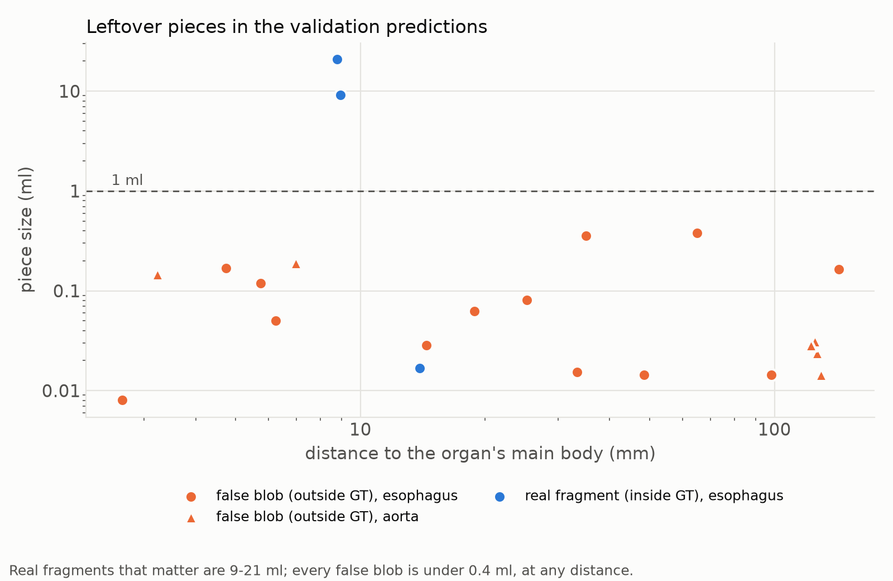

# 4. Post-processing

Final rule: `postprocess.py --lcc 2 3 --min_ml 4:1`. That means: keep the largest
connected component of the heart and the trachea; remove aorta pieces smaller
than 1 ml; leave the esophagus alone.

## Two failure modes, opposite treatment

1. **Stray false positives far from the organ.** Patient_37's heart is predicted
   far below the real heart (HD95 160 mm); Patient_17 has a trachea piece at
   103 mm. Removing pieces fixes this.
2. **Gaps in the tubes.** The esophagus and aorta break into pieces. Removing
   pieces makes this worse: team run E021 found that "keep the largest piece"
   deletes the real organ beyond a gap.

| Before | After |
|---|---|
|  |  |

## Result (validation, 8 patients)

| | Dice | HD95 (mm) | ASSD (mm) | heart HD95 | trachea HD95 | aorta HD95 |
|---|---|---|---|---|---|---|
| no post-processing | 0.890 | 15.1 | 2.11 | 26.0 | 20.0 | 7.7 |
| + LCC heart and trachea | 0.892 | 7.9 | 1.49 | 6.6 | 10.4 | 7.7 |
| + aorta pieces < 1 ml (final) | 0.892 | 7.8 | 1.49 | 6.6 | 10.4 | 7.4 |

The mean HD95 halves, but **how well that is supported** is the point of
[05_critical_analysis.md](05_critical_analysis.md):
- The heart gain is one patient.
- The trachea is one patient much better and two worse.
- The aorta step changes one patient.

## Why size, not distance, and why the esophagus is left alone

For every leftover esophagus/aorta piece in the validation predictions we
measured its size, its distance to the organ's main body, and whether it lies
inside the GT.
- Real fragments are 9-21 ml.
- Every false blob is under 0.4 ml, at distances from 3 to 143 mm.

So a size threshold separates them and a distance threshold cannot.

The small esophagus pieces are false, yet removing them makes esophagus HD95
worse (Patient_19: 13.3 -> 21.0 mm). All four lie 5-13 mm from the true
esophagus, inside the stretch where the prediction has a gap. They are the
network finding the right place in scraps. They are a symptom of
under-segmentation, so post-processing is the wrong tool for them.

## Two ideas that did not work

| Idea | Why we tried it | What happened |
|---|---|---|
| Keep pieces within 10 mm of the organ, drop the rest (`--keep_near`) | Should keep fragments across a gap and drop distant blobs | Removed a real esophagus piece beyond a > 10 mm gap; esophagus HD95 worse on 2 / 8 patients, better on none |
| Fill gaps with low-confidence voxels connected to the organ (`infer3d.py --hysteresis`) | If gaps are voxels where the organ was the runner-up, a lower threshold can bridge them | Inconclusive on the esophagus (4 better / 1 worse, CI crosses 0), slightly worse on the aorta. Gaps are confidently predicted as background, so this is a training problem (see next steps) |
